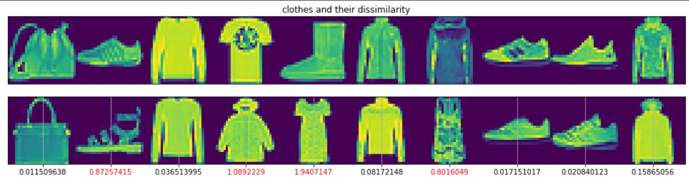

# Object-Recognition-using-Siamese-Network

In this project, I had Implemented Siamese Network using Tensorflow to detect similarity/dissimilarity between two Fashion MNIST images.Then created positive/negative pair of images and divided them into train and test dataset. Build the Siamese Network and configured training pipeline. And finally iterated over various hyper parameters to achieve maximum accuracy and trained the model for 20 epochs obtaining accuracy of 94.86% on trian dataset 93.32% on validation dataset.

Plot of loss metric can be seen below where blue and green line represent train and val dataset respectively.

Visualization of sample results for 10 pairs of items are shown below.

